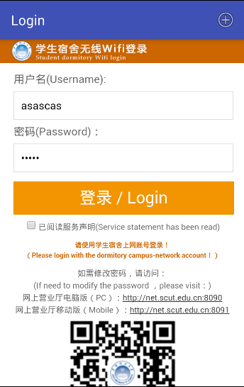
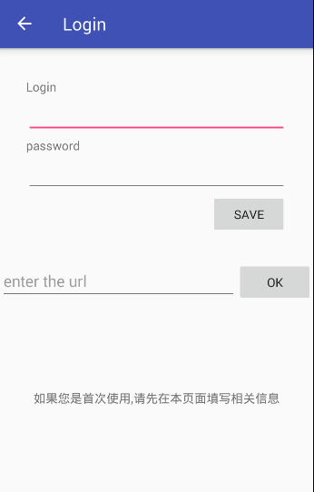

# 校园网一键登录客户端

---

目前仅提供安卓版本,点击下载 apk

## 使用说明

初次使用时,打开 app 后先点击右上方的 "+" 添加校园网帐号和密码, URL 地址为校园网登录地址,获取方式如下:连上校园网后打开浏览器自动跳转到校园网登陆界面,复制网页地址.回到本 app 中,在 URL 栏长按,粘贴,点击 ok 保存,URL成功保存后点击左上角的 "<--" 返回主页,此时主页会自动重新加载,最终显示填写好的表单,点击 "登录" 即可登录到校园网,按 "home" 键返回手机主界面

二次使用时,打开 app 即可自动加载和显示填写好的表单,点击 "登录" 即可登录校园网,按 "home" 返回手机主界面

修改已有数据时,只需点击右上角 "+" ,重新填入新数据即可

 app 默认打开最近一次保存在本地的校园网 URL 地址(首次使用打开空白页面),URL地址含有wlanacip参数,该参数可能随着不同位置的AC面板而不同,也就是说,一楼的URL跟三楼的URL可能不一样,建议在URL栏填写最常用的URL地址,免去每次登录都要获取并填写与当前位置相关的URL地址

## 软件截图

## 原理说明

打开 app 时, app 在 /data/data/com.example.user0308.login/files/ 路径下的 "URL" 文件中读取 URL 值,

&emsp;&emsp;若不存在 "URL" 文件(初次使用情景),则提示用户并停止打开 URL 页面;

&emsp;&emsp;若存在 "URL" 文件,则读取其中的 URL 字符串,若读取过程中出错,则返回 null 并停止打开 URL 页面;

&emsp;&emsp;存在 "URL" 文件且读取过程中没有出错,得到正确的 URL ,则加载该 URL ,加载完成时,读取 /data/data/com.example.user0308.login/files/ 路径下的 "wasduy" 文件,
      
&emsp;&emsp;&emsp;&emsp;若不存在 "wasduy" 文件(初次使用情景), 则提示用户且不执行 javascript 脚本文件

&emsp;&emsp;&emsp;&emsp;若存在 "wasduy" 文件但读取过程出错, 则提示用户且不执行 javascript 脚本文件

&emsp;&emsp;&emsp;&emsp;若存在 "wasduy" 文件且读取正确,则执行 javascript 脚本文件,在 URL 页面找到 vipDefaultAccount 和 vipDefaultPassword ,并将其 value 设置为相应的值,然后显示加载完并填写好表单的页面给用户

用户点击右上角的 "+" 时,触发新 activity ,显示 username , password 和 URL 信息,用户输入 username 和 password 信息后点击 save 按钮,系统检查填写是否为空,为空则提示用户,不为空则把数据保存到本地 /data/data/com.example.user0308.login/files/ 路径下的 "wasduy" 文件中

同样,填写完 URL 后点击 ok ,系统检查填写是否为空,为空则提示用户,不为空则把数据保存到本地 /data/data/com.example.user0308.login/files/ 路径下的 "URL" 文件中

## 可能遇到的问题
* app 显示 "无法打开页面", 

可能原因: 未开启 wifi ,或 wifi 未连上校园网

具体表现:打开浏览器,随便打开一个网页,都不会跳转到校园网的自动登录界面

解决办法:在校园网覆盖的地方开启 wifi

* app 打开时没有自动填写表单,

可能原因: 初次使用,路径下没有相关文件或读取文件过程出错

解决办法: 点击右上方 "+" ,填写相关信息

* 点击登录后显示 AC 认证失败

具体表现: 在主界面手动输入帐号密码登录时仍然提示该信息

可能原因: URL 错误, URL 中的参数会随着 AC 面板位置的不同而不同

解决办法: 在浏览器中随便打开一个网页,自动跳转到校园网登录界面时,复制网页地址,回到本 app 中,点击右上方 "+" ,在 URL 栏长按,粘贴,点击 ok 保存,点击左上角 "<--" 返回主界面,重新登录

* 点击登录后显示登录人数超出限制

可能原因: 前一次登录还没注销或两次登录时间间隔少于十五分钟

具体表现: 

解决办法: 若当前连上 wifi 还能上网,则退出 app 即可,若连上 wifi 不能上网且提示登录人数超出限制,则断开校园网 wifi , 15 分钟后重登即可

### 版本更新

v1.0: 显示特定 URL 网页, js 填写特定表单数据

v2.0: 增加 "+" 和 "<---", 自由切换界面,支持用户填写表单,并将表单数据保存在本地,支持表单 vipDefaultPassword 项 value 值为 String 类型

v2.1: 添加 URL 栏,支持打开用户指定的 URL 地址,并把 URL 保存在本地L 保存在本地地地地